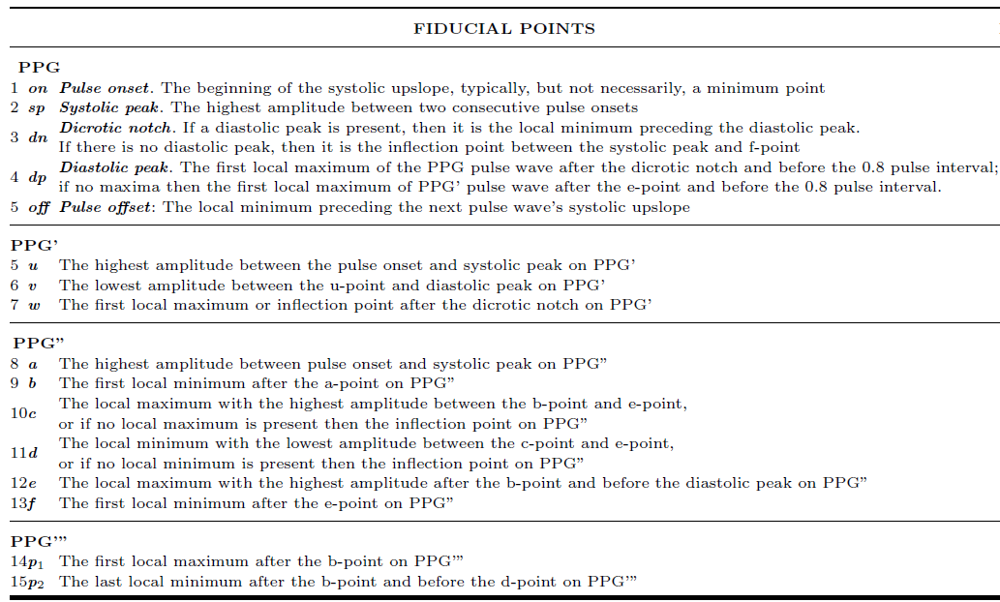
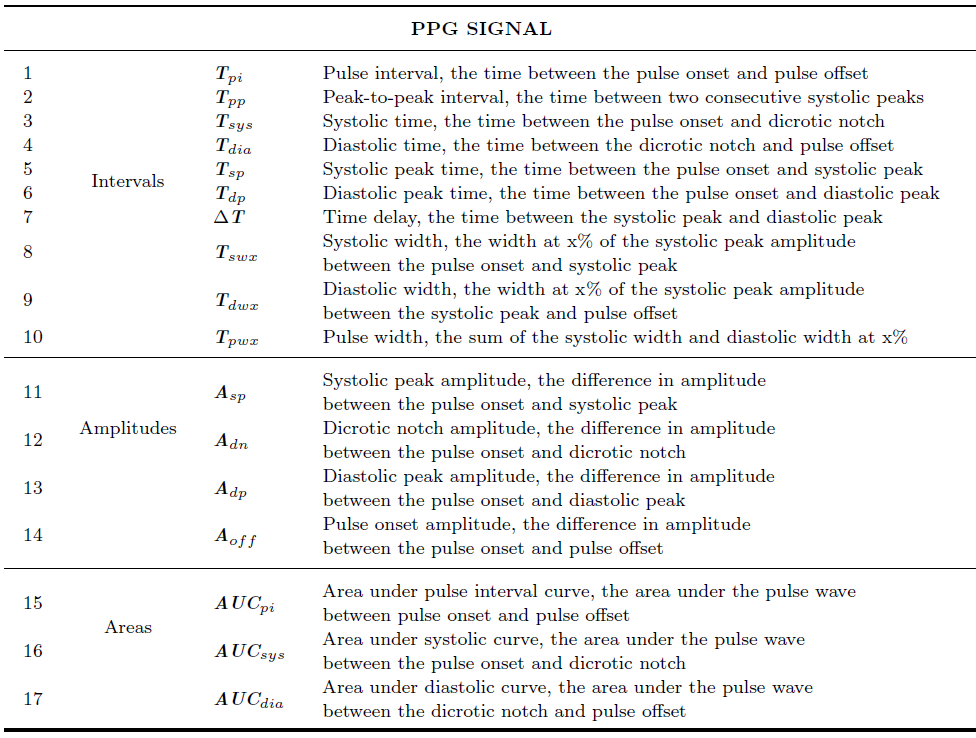
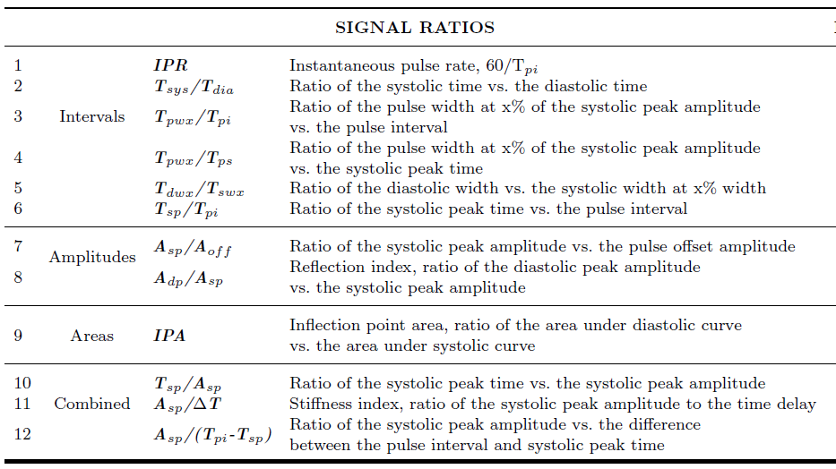
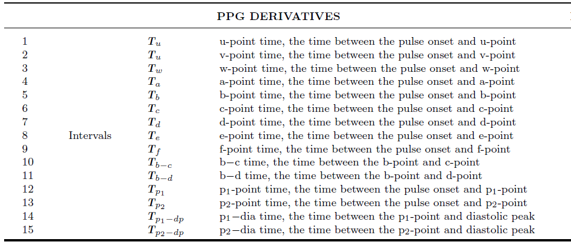
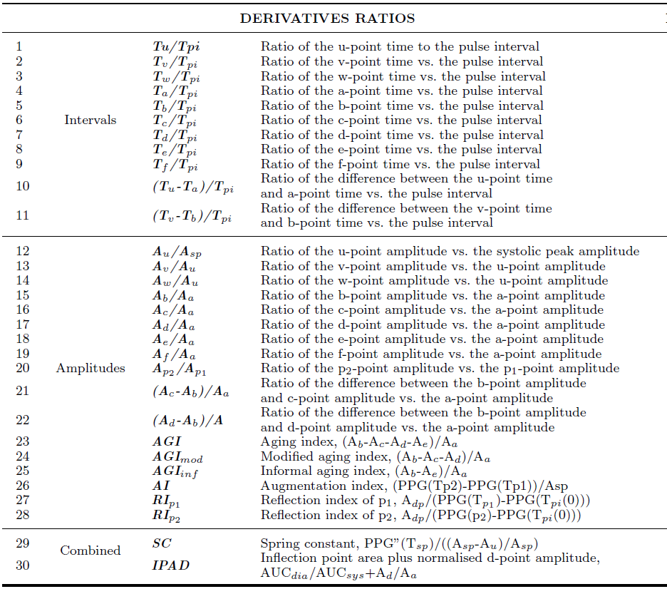

# *pyPPG* toolbox documentation

Photoplethysmogram (PPG) beat detection, fiducial points detection, and comprhessive assessment of standard biomarkers.

## Introduction
The ***pyPPG*** is a standardised toolbox to analyze long-term finger PPG recordings in real-time. The state-of-the-art PPG biomarkers have been identified, implemented in the *pyPPG* toolbox, and validated on standard, public available PPG databases.
The *pyPPG* using the improved *Automatic Beat Detector* [(*Aboy et al. 2005*)](https://ieeexplore.ieee.org/abstract/document/1510850).  The PPG peak and onset detection are implemented with. The *pyPPG* offers a robust beat detection, and a comprhessive assessment of clinically relevant biomarkers of continuous PPG time series.

## Description
The following steps are implemented in the ***pyPPG*** toolbox:
1. **Loading a raw PPG signal**: The toolbox can accept various file formats such as *.mat*, *.csv*, *.txt*, or *.edf*. These files should contain raw PPG data along with the corresponding sampling rate.
2. **Preprocessing**: The raw signal is filtered to remove unwanted noise and artifacts. Subsequently, the signal is resampled to a uniform rate of 75 Hz.
3. **Pulse wave segmentation**: The toolbox employs a peak detector to identify the systolic peaks. Based on the peak locations, the toolbox also detects the pulse onsets and offsets, which indicate the start and end of the PPG pulse waves.
4. **Fiducial points identification**: For each pulse wave, the toolbox detects a set of fiducial points.
5. **Biomarker engineering**: Based on the fiducial points, a set of 74 PPG digital biomarkers are engineered.

The *pyPPG* toolbox also provides an optional PPG signal quality index based on the Matlab implementation of the work by [(*Li et al. 2015*)](https://github.com/MIT-LCP/PhysioNetChallengePublic/blob/master/2015/sample-submission/ppgSQI.m).

.

### Preprocessing
- **Prefiltering**
  Before computing the PPG morphological biomarkers, prefiltering of the raw PPG time series is performed to remove the baseline wander as well as remove high-frequency noise.  The following filters have been implemented as default in the pyPPG toolbox:
  - ***Bandpass filtering between 0.5−12 Hz***: A fourth-order Chebyshev Type II filter was used for the original signal. The 12 Hz low-pass cut-off was used to avoid time-shifting of fiducial points (particularly pulse onset, and dicrotic notch) and to eliminate unwanted high-frequency content from the PPG derivatives. The 0.5 Hz high-pass cut-off was used to minimize baseline wandering whilst retaining content at low heart rates.
  - ***20 ms moving average filtering (MAF)***: In the case of very noisy signals, some high-frequency content can remain in the band-pass filter signal. For this purpose, a 20 ms standard flat (boxcar or top-hat) MAF with a 22.5 Hz cut-off frequency was applied after the band-pass filtering.
  - ***10 ms MAF for the PPG derivatives***: To eliminate the high-frequency content in the PPG derivatives, a 10 ms standard flat (boxcar or top-hat) MAF with 45 Hz cut-off frequency was applied.

- **Re-sampling**
  The default behavior of the toolbox is to resample PPG signals at 75 Hz using the *Python resample* function using the Fourier method.   

### Pulse wave segmentation
The toolbox identifies individual pulse waves in a PPG signal by identifying ***systolic peaks (sp)***, and then
identifying the ***pulse onset (on)*** and ***offset (off)*** on either side of each systolic peak which indicate the
start and end of the pulse wave, respectively.

### Fiducial points identification

### Biomarker engineering
**Calculate 74 Biomarkers**
 The *pyPPG* toolbox includes a comprehensive collection of 74 standard PPG morphological biomarkers which are calculated from the timings and amplitudes of the fiducial points. The biomarkers were categorized into four groups: 
- **PPG Signal** - biomarkers that are based on the location of the fiducial points of the PPG signal; 
- **Signal Ratios** - biomarkers that are based on ratios of the fiducial points of the PPG signal;
- **PPG Derivatives** - biomarkers that are based on the location of the fiducial points of the PPG derivatives; 
- **Derivatives Ratios** - biomarkers that are based on ratios of the fiducial points of the PPG derivatives.

**General Statistics of biomarkers**
  For a given window consisting of a set of beats, *pyPPG* provides the following nine general statistics for each biomarker: signal duration; average (AVG); median (MED); standard deviation (STD); lower and upper quartiles (Q1, Q3); inter-quartile range (IQR); Skewness (SKW, indicating a lack of symmetry in the distribution; Kurtosis (KUR, indicating the pointedness of a peak in the distribution curve); and the average difference between the mean and each data value (MAD).

## Installation
(Available on pip, with the command: 
***pip install pyppg***)

## Requirements

### Python Requirements:

Python >= 3.10
scipy == 1.9.1
numpy == 1.23.2
dotmap == 1.3.30
pandas == 1.5.0
wfdb == 4.0.0
mne == 1.2.0

All the python requirements are installed when the toolbox is installed, no need for additional commands.

### System Requirements:

To run the wavdet fiucial-points detector matlab runtime (MCR) 2021a is requierd.
https://www.mathworks.com/products/compiler/matlab-runtime.html

## Documentation:

https://pyppg.readthedocs.io/en/latest/

## The main components:
1. **Software**
    - An open-source algorithmic ***pyPPG*** toolbox, which implements the PPG peak and onsets detection algorithms and prefiltering routines. This can be used within your own data analysis code using the ***pyPPG*** API.
2. **Databases**
    - The PPG signals are based on the ***PhysioNet Databases***. Available [here](https://physionet.org/about/database/) .
3. **Configuration**
    - A set of configuration files that adapt the PPG peak detection and ***pyPPG*** algorithms to work with sleep PPG data.

All PPG measures can be further adapted for the analysis for efficient heart rate measurement as well as health assessment with clinically relevant biomarkers.
