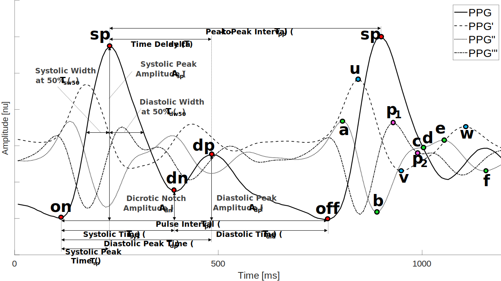

# *pyPPG* toolbox documentation

Photoplethysmogram (PPG) beat detection, fiducial points detection, and comprhessive assessment of standard biomarkers.

If you use the pyPPG resource, please cite: "Under review"

## Introduction
***pyPPG*** is a standardised toolbox to analyze long-term finger PPG recordings in real-time. The toolbox extracts state-of-the-art PPG biomarkers (_i.e._ pulse wave features) from PPG signals. The algorithms implemented in the *pyPPG* toolbox have been validated on publicly available PPG databases.
Consequently, *pyPPG* offers robust and comprhessive assessment of clinically relevant biomarkers from continuous PPG signals.

## Description
The following steps are implemented in the ***pyPPG*** toolbox:

1. **Loading a raw PPG signal**: The toolbox can accept PPG signals in various file formats such as *.mat*, *.txt*, *.csv*, or *.edf*. These files should contain raw PPG data along with the corresponding sampling rate. 
   * *.mat*: Data should be stored in a structure containing two fields: (i) 'Fs' representing the sampling frequency, and (ii) 'Data', a vector containing the raw PPG signal.
   * *.txt*: It contains tabular data of the raw PPG signal (single tab or space-delimited), and you need to provide the sampling frequency as an input parameter to the script using 'fs'.
   * *.csv*: This format stores raw PPG signal data with comma separation. Similar to .txt, the sampling frequency must be provided as an input parameter to the script using 'fs'.
   * *.edf*: The [European Data Format](https://www.edfplus.info/) is supported, and it applies 'Pleth' or 'PPG' channels by default. However, if using different channel name, the user needs to define it themselves.
3. **Preprocessing**: The raw signal is filtered to remove unwanted noise and artifacts. Subsequently, the signal is resampled to 75 Hz.
3. **Pulse wave segmentation**: The toolbox employs a peak detector to identify the systolic peaks. It uses an [improved version](https://arxiv.org/abs/2307.10398) of a beat detection algorithm originally proposed in [(*Aboy et al. 2005*)](https://doi.org/10.1109/TBME.2005.855725). Based on the peak locations, the toolbox also detects the pulse onsets and offsets, which indicate the start and end of the PPG pulse waves.
4. **Fiducial points identification**: For each pulse wave, the toolbox detects a set of fiducial points.
5. **Biomarker engineering**: Based on the fiducial points, a set of 74 PPG digital biomarkers (_i.e._ pulse wave features) are calculated.

The *pyPPG* toolbox also provides an optional PPG signal quality index based on the Matlab implementation of the work by [(*Li et al. 2015*)](https://github.com/MIT-LCP/PhysioNetChallengePublic/blob/master/2015/sample-submission/ppgSQI.m).

.

The toolbox identifies individual pulse waves in a PPG signal by identifying ***systolic peaks (sp)***, and then
identifying the ***pulse onset (on)*** and ***offset (off)*** on either side of each systolic peak which indicate the
start and end of the pulse wave, respectively.

## Installation
Available on pip, with the command: 
***pip install pyPPG***

pip project: https://pypi.org/project/pyPPG/

For more details see the [pyPPG example code](https://pyppg.readthedocs.io/en/latest/tutorials/pyPPG_example.html)

## Requirements
### Python Requirements:

Python >= 3.10

scipy == 1.9.1

numpy == 1.23.2

dotmap == 1.3.30

pandas == 1.5.0

wfdb == 4.0.0

mne == 1.2.0

All the python requirements are installed when the toolbox is installed, so there is no need for any additional commands.

## Documentation:
https://pyppg.readthedocs.io/en/latest/

## The main components:
1. **Software**
    - An open-source algorithmic ***pyPPG*** toolbox, which loads a PPG signal, preprocesses it, segments individual pulse waves, identifies fiducial points, and calculates a set of biomarkers. This can be used within your own data analysis code using the ***pyPPG*** API.
2. **Databases**
    - The ***pyPPG*** signal analysis is based on the following datasets: 
      - [BIDMC Dataset](https://physionet.org/content/bidmc/1.0.0/)
      - [MESA Dataset](https://sleepdata.org/datasets/mesa)
    - Further PPG datasets:
      - [Collection of Peter Charlton](https://peterhcharlton.github.io/post/ppg_datasets/) 
      - [Collection of Physionet](https://physionet.org/content/?topic=ppg)

3. **Configuration**
    - A set of configuration files that adapt the PPG peak detection and ***pyPPG*** algorithms to work with sleep PPG data.

All PPG measures can be further adapted for the analysis for efficient heart rate measurement as well as health assessment with clinically relevant biomarkers.
